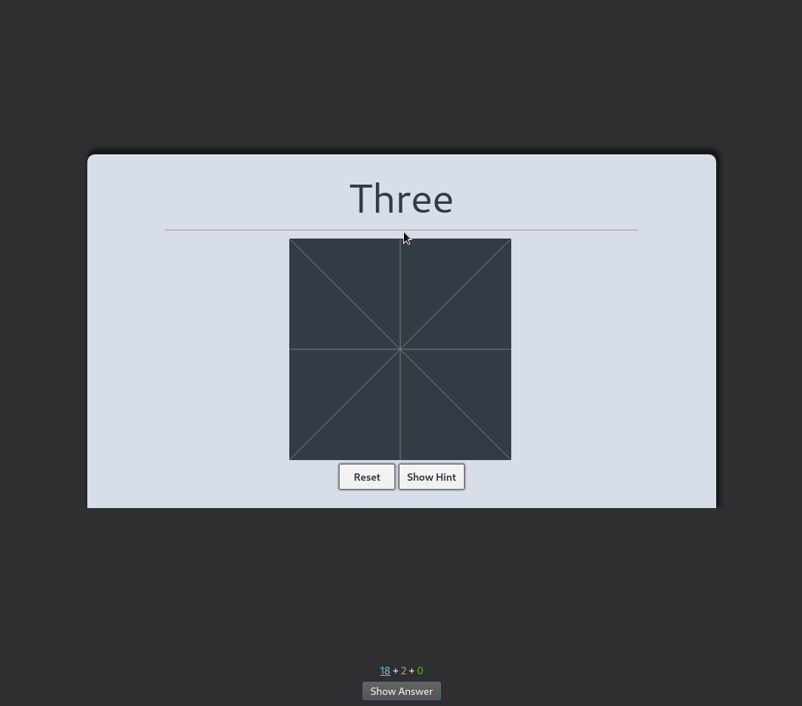

# Anki-RTK
An RTK deck with Hanzi Writer Implemented for touch screen

NOTE: Current release of android does not officially support JQuery. the result is the popup information for kanji won't work on ankidroid. This will be fixed in a future update however I am currently using this release AnkiDroid 2.15alpha26 and it works well. in the future, this will no longer be an issue so check your current version first.

## Getting started

In order to install and later upgrade, you'll need to first install an Anki add-on called [CrowdAnki](https://github.com/Stvad/CrowdAnki):

1. Open Anki on your computer, go to the _Tools_ menu and select _Add-ons_.
1. In the dialog box, click on _Get Add-ons..._ and paste in the code provided on [this page](https://ankiweb.net/shared/info/1788670778).
1. Click on _OK_ to install the add-on, and then restart Anki.

You're now ready to install:

1. Go to the **[_Releases_ page](https://github.com/TowelSniffer/Anki-RTK/releases)**.
1. In the latest release's _Downloads_ section, download the ZIP archive of the deck, "Kanji.rar".
1. Extract the content of the archive on your computer.
1. Open Anki and make sure your devices are all synchronised.
1. In the _File_ menu, select _CrowdAnki: Import from disk_.
1. Browse for and select the folder you extracted from the archive, which contains the deck's JSON file -- e.g. `Kanji`.
1. Don't change anything in the _CrowdAnki Import Settings_ dialog box that opens -- just press _OK_ to start the import. A dialog box should then confirm that the import was successful.
1. Download the Media Files.rar folder and extract. Copy the contents of the Media Files folder into you anki collection.media folder

👉 To stay informed of new releases, make sure to [watch this repository's releases](https://help.github.com/en/articles/watching-and-unwatching-releases-for-a-repository).

## Upgrading

The upgrade process is typically the same as the installation process explained in the [previous section](#getting-started). However, some situations require extra care. As a general rule, **always read the release notes carefully**; they will likely tell you what to do or point you to a page that does.

## resources used For this were:

#### hanzi-writer
https://github.com/chanind/hanzi-writer

#### hanzi-writer-data-jp
https://github.com/chanind/hanzi-writer-data-jp

#### kana-json
https://github.com/ailectra/kana-json

#### anki-persistence
https://github.com/SimonLammer/anki-persistenceanki-persistence

#### MEMRISE KANJAX with KOOHI
https://greasyfork.org/en/scripts/31169-memrise-kanjax-with-koohi-v3/code

#### ultimate geography for the plagiarized readme
https://github.com/anki-geo/ultimate-geography
